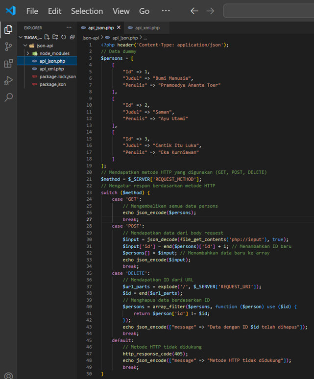
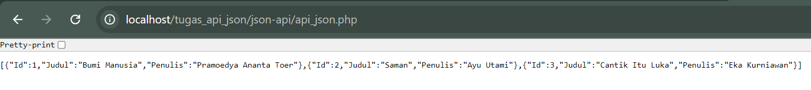

1. Membuat endpoint GET di API JSON dan XML yang mengembalikan daftar item (misalnya, daftar buku atau daftar film).
   
   

2. Membuat endpoint POST di API JSON dan XML yang memungkinkan pengguna menambahkan item baru ke daftar.
